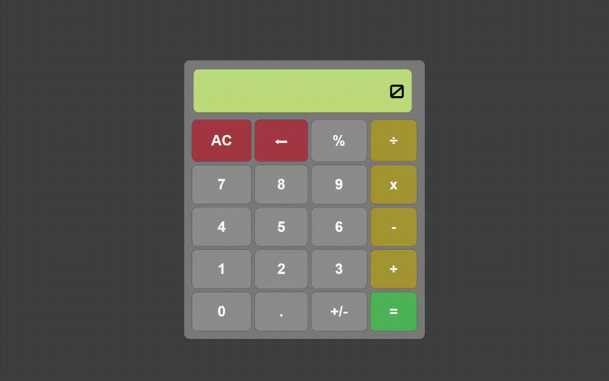

# Calculator

[Link](https://wblachut.github.io/Calculator_TheOdinProject/) to calculator!

##
## PROJECT: CALCULATOR

## Description

Basic online calculator. Project was a part of The Odin Project Web Development learning curriculum.

## Concepts used and learned:

* DOM manipulation
* Event Listeners
* CSS styling
* Switch statement

## Tools:

* Visual Studio Code
* Javascript
* CSS3
* HTML5

## Possible updates in future:

* fix big numbers display
* make hidden fibonacci function
* add keyboard support
* add more match features
